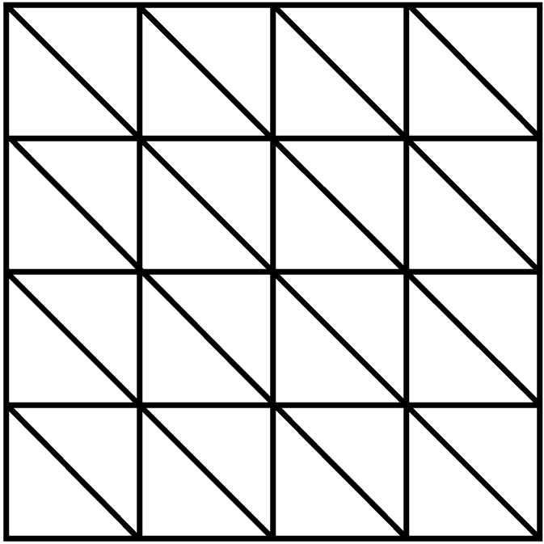
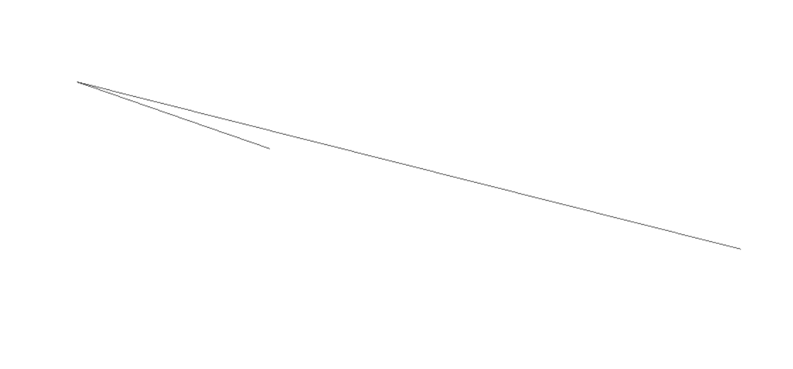
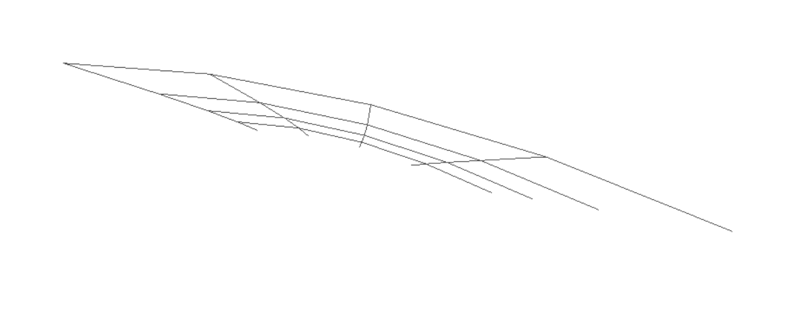
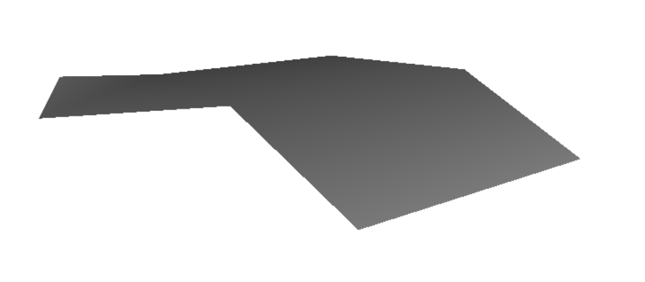
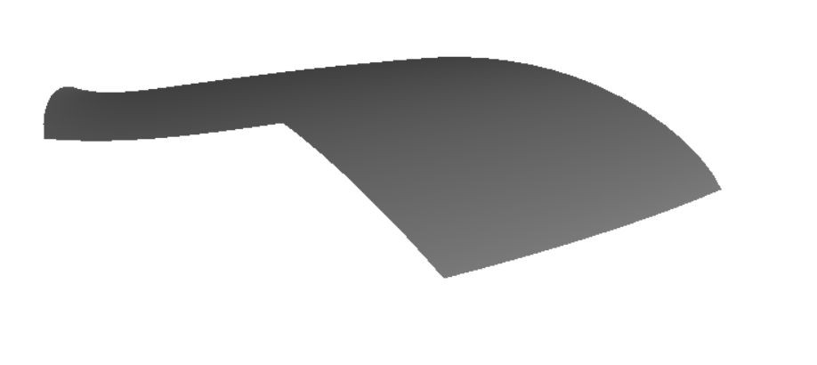
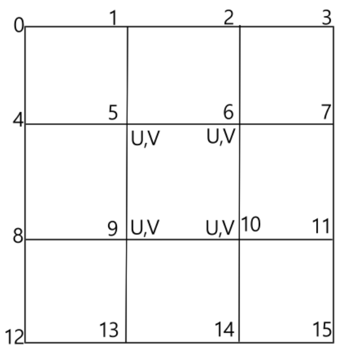
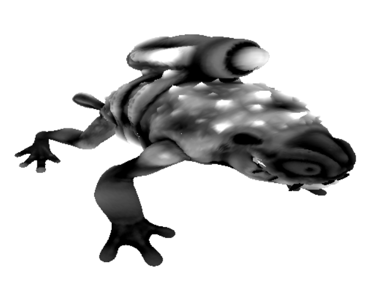
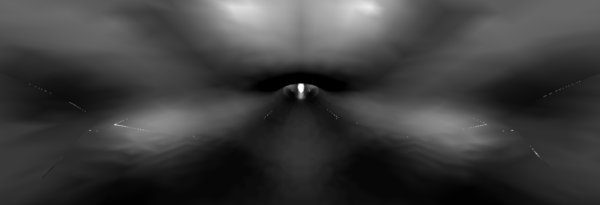

# structure of the program

## Table of Contents
- [Setup](#setup)
- [Preprocesser](#preprocesser)
- [Render](#render)
- [Animation](#real-time-animation)
- [Texture Mapping](#texture-mapping)

## Setup

## Preprocesser
### create json data
In topology.json, data of each object is stored in the following structure:
```json
{
    "data":{
        "e_data" : [...],
        "e_indices" : [...],
        "f_data" : [...],
        "f_indices" : [...],
        "f_offsets" : [...],
        "f_valances" : [...],
        "v_data" : [...],
        "v_index" : [...],
        "v_indices" : [...],
        "v_offsets" : [...],
        "v_valances" : [...]
    },
    "depth" : n
}
```

### create buffers and pipelines

### create bindgroups


## Render

Our rendering process is divided into 4 main steps:

1. [Subdivision](#subdivision)
2. [Limit points](#limit-points)
3. [Draw ordinary points](#draw-ordinary-points)
4. [Draw limit points](#draw-limit-points)


### Subdivision

To perform Catmull-Clark subdivision based on topology.json, we use a compute shader to calculate the position of each point. At each step of the subdivision, new vertices are generated for each face, edge and vertex. This process is executed in parallel using WebGPU's compute shader.

Following is wgsl codes of each compute shader module in function createPipelines() in pipelines.js.
``` javascript
    const module_Face = device.createShaderModule({
        code: `
        @group(0) @binding(0) var<storage, read> vertex_F: array<i32>;
        @group(0) @binding(1) var<storage, read> offset_F: array<i32>;
        @group(0) @binding(2) var<storage, read> valance_F: array<i32>;
        @group(0) @binding(3) var<storage, read> pointIdx_F: array<i32>;
        @group(0) @binding(4) var<storage, read_write> baseVertex: array<f32>;


        @compute @workgroup_size(256)
        fn compute_FacePoint(@builtin(global_invocation_id) global_invocation_id: vec3<u32>){
            let id = global_invocation_id.x;
            let start = u32(vertex_F[0]*4);

            let index = vertex_F[id];
            let offset = offset_F[id];
            let valance = valance_F[id];

            var pos = vec3(0.0,0.0,0.0);

            for (var i=offset; i<offset+valance ; i++ ){
            pos.x = pos.x + ( baseVertex[pointIdx_F[i]*4]) / f32(valance);
            pos.y = pos.y + ( baseVertex[(pointIdx_F[i]*4)+1] / f32(valance));
            pos.z = pos.z + ( baseVertex[(pointIdx_F[i]*4)+2] / f32(valance));
            }

            baseVertex[start+id*4] = pos.x;
            baseVertex[start+id*4+1] = pos.y;
            baseVertex[start+id*4+2] = pos.z;
            baseVertex[start+id*4+3] = 0;
        }
        `
    });

    const module_Edge = device.createShaderModule({
        code: `
        @group(0) @binding(0) var<storage, read> vertex_E: array<i32>;
        @group(0) @binding(1) var<storage, read> pointIdx_E: array<i32>;
        @group(0) @binding(2) var<storage, read_write> baseVertex: array<f32>;

        @compute @workgroup_size(256)
        fn compute_EdgePoint(@builtin(global_invocation_id) global_invocation_id: vec3<u32>){
            let id = global_invocation_id.x;
            let start2 = u32(vertex_E[0]*4);

            let index = vertex_E[id];
            let offset = 4*id;

            var pos = vec3(0.0,0.0,0.0);

            for (var i=offset; i<offset+4 ; i++ ){
            pos.x = pos.x + ( baseVertex[pointIdx_E[i]*4]) / 4;
            pos.y = pos.y + ( baseVertex[(pointIdx_E[i]*4)+1] ) / 4;
            pos.z = pos.z + ( baseVertex[(pointIdx_E[i]*4)+2] ) / 4;
            }

            baseVertex[start2+id*4] = pos.x;
            baseVertex[start2+id*4+1] = pos.y;
            baseVertex[start2+id*4+2] =pos.z;
            baseVertex[start2+id*4+3] = 0;
        }
        `
    });

    const module_Vertex = device.createShaderModule({
        code: `
        @group(0) @binding(0) var<storage, read> vertex_V: array<i32>;
        @group(0) @binding(1) var<storage, read> offset_V: array<i32>;
        @group(0) @binding(2) var<storage, read> valance_V: array<i32>;
        @group(0) @binding(3) var<storage, read> index_V: array<i32>;
        @group(0) @binding(4) var<storage, read> pointIdx_V: array<i32>;
        @group(0) @binding(5) var<storage, read_write> baseVertex: array<f32>;


        @compute @workgroup_size(256)
        fn compute_VertexPoint(@builtin(global_invocation_id) global_invocation_id: vec3<u32>){
            let id = global_invocation_id.x;
            let start = u32(vertex_V[0]*4);

            let index = vertex_V[id];
            let oldIndex = index_V[id];
            let offset = offset_V[id];
            let valance = valance_V[id]/2;

            var pos = vec3(0.0,0.0,0.0);

            for (var i=offset; i<offset+(valance*2) ; i++ ){
            pos.x = pos.x + ( baseVertex[pointIdx_V[i]*4]) / (f32(valance)*f32(valance));
            pos.y = pos.y + ( baseVertex[(pointIdx_V[i]*4)+1] ) / (f32(valance)*f32(valance));
            pos.z = pos.z + ( baseVertex[(pointIdx_V[i]*4)+2] ) / (f32(valance)*f32(valance));
            }

            baseVertex[start+id*4] = (pos.x + (baseVertex[oldIndex*4] * (f32(valance-2)/f32(valance))));
            baseVertex[start+id*4+1] = pos.y + (baseVertex[oldIndex*4+1] * (f32(valance-2)/f32(valance)));
            baseVertex[start+id*4+2] = pos.z + (baseVertex[oldIndex*4+2] * (f32(valance-2)/f32(valance)));
            baseVertex[start+id*4+3] = 0;
        }
        `
    });
```

```javascript
function make_compute_encoder(device, pipeline, bindgroup, workgroupsize, text = " ") {
    const encoder = device.createCommandEncoder({label: text});
    const pass = encoder.beginComputePass({label: text});
    pass.setPipeline(pipeline);
    pass.setBindGroup(0, bindgroup);
    pass.dispatchWorkgroups(workgroupsize);
    pass.end();
    const commandBuffer = encoder.finish();
    device.queue.submit([commandBuffer]);
}
```


### Limit points


### Draw ordinary points(patch)

For the ordinary points, we use b-spline patch to draw. Patch with same subdivision level and same texture part have no problem to draw. But when we draw patches with different subdivision level or different texture part, we need to do some extra work.

For the patches with different subdivision level, we use tessellation to draw.

This is the code to generate the texcoord and index data for the tessellation:
```javascript
for (let i = 0; i <= depth; i++) {
    let N = max(2**(depth-i-patchLevel), 1);
    // let N = 1.0;
    let texcoordData = new Float32Array((N + 1) * (N + 1) * 2);
    let offset = 0;
    for (let row = 0; row <= N; ++row) {
        for (let col = 0; col <= N; ++col) {
            texcoordData[offset++] = (row / N);
            texcoordData[offset++] = (col / N);
        }
    }
    texcoordDatas.push(texcoordData);
    let texcoordData_byteLength = texcoordData.byteLength;
    texcoordData_byteLengths.push(texcoordData_byteLength);
    let index = new Uint32Array(N * N * 6);
    offset = 0;
    for (let row = 0; row < N; ++row) {
        for (let col = 0; col < N; ++col) {
            index[offset++] = (row + col * (N + 1));
            index[offset++] = (row + (col + 1) * (N + 1));
            index[offset++] = (row + col * (N + 1) + 1);
            index[offset++] = (row + col * (N + 1) + 1);
            index[offset++] = (row + (col + 1) * (N + 1));
            index[offset++] = ((row + 1) + (col + 1) * (N + 1));
        }
    }
    indices.push(index);
    let index_byteLength = index.byteLength;
    index_byteLengths.push(index_byteLength);
}
```
For example if max depth is 5, and the subdivision level of patch is 3, patch will be divided as following image.



위의 테셀레이션을 위해 만들어진 데이터를 setvertexbuffer, setindexbuffer로 지정한다. 그 후 drawIndexed(m, n)을 호출하면 n개의 instance(=patch)를 각각 m개의 vertex로 draw한다. 이때 m개의 vertex는 vertexBuffer에 정의되어있고, draw 순서는 indexBuffer에 정의된다.



각각의 patch는 서로 다른 좌표에 draw되어야한다. 해당 데이터는 patch.txt에 저장되어 있고 storagebuffer로 사용한다.
patch의 vertex position들은 cubic b-spline으로 연산된다.



```javascript
    const module1 = device.createShaderModule({
        code: /*wgsl*/ `

        struct Uniforms {
            matrix: mat4x4f,
            view: vec3f,
            time: f32,
            wireAdjust: f32,
        };
        ...
        // structs
        ...

        struct VSOutput {
            @builtin(position) position: vec4f,
            @location(0) color: vec4f,
        };

        @group(0) @binding(0) var<uniform> uni: Uniforms;
        @group(0) @binding(1) var<storage, read> pos2: array<vec4f>;
        @group(0) @binding(2) var<storage, read> base_normal: array<vec4f>;
        @group(1) @binding(0) var<storage, read> conn: array<i32>;
        @group(1) @binding(1) var<storage, read> base_UV: array<vec2f>;
        @group(1) @binding(2) var<storage, read> color: Color;

        fn B0(t: f32) -> f32 {
            return (1.0/6.0)*(1.0-t)*(1.0-t)*(1.0-t);
        }
        fn B0prime(t: f32) -> f32 {
            return (-1.0/2.0)*(1.0-t)*(1.0-t);
        }
        fn B1(t: f32) -> f32 {
            return (1.0/6.0)*(3.0*t*t*t - 6.0*t*t + 4.0);
        }
        ...
        // function for B-spline
        ...
        fn B3prime(t: f32) -> f32 {
            return (1.0/2.0)*t*t;
        }

        @vertex fn vs(
            @builtin(instance_index) instanceIndex: u32,
            @builtin(vertex_index) vertexIndex: u32,
            vert: IndexVertex
        ) -> VSOutput {
            var vsOut: VSOutput;

            let p =  B0(vert.position.x)*B0(vert.position.y)*pos2[  conn[instanceIndex*16+ 0]  ].xyz
                    +B0(vert.position.x)*B1(vert.position.y)*pos2[  conn[instanceIndex*16+ 1]  ].xyz
                    ...
                    // B-spline
                    ...
                    +B3(vert.position.x)*B2(vert.position.y)*pos2[  conn[instanceIndex*16+14]  ].xyz
                    +B3(vert.position.x)*B3(vert.position.y)*pos2[  conn[instanceIndex*16+15]  ].xyz;

            let tu = B0prime(vert.position.x)*B0(vert.position.y)*pos2[  conn[instanceIndex*16+ 0]  ]
                    +B0prime(vert.position.x)*B1(vert.position.y)*pos2[  conn[instanceIndex*16+ 1]  ]
                    ...
                    // B-spline
                    ...
                    +B3prime(vert.position.x)*B2(vert.position.y)*pos2[  conn[instanceIndex*16+14]  ]
                    +B3prime(vert.position.x)*B3(vert.position.y)*pos2[  conn[instanceIndex*16+15]  ];

            let tv = B0(vert.position.x)*B0prime(vert.position.y)*pos2[  conn[instanceIndex*16+ 0]  ]
                    +B0(vert.position.x)*B1prime(vert.position.y)*pos2[  conn[instanceIndex*16+ 1]  ]
                    ...
                    // B-spline
                    ...
                    +B3(vert.position.x)*B2prime(vert.position.y)*pos2[  conn[instanceIndex*16+14]  ]
                    +B3(vert.position.x)*B3prime(vert.position.y)*pos2[  conn[instanceIndex*16+15]  ];

            var normal = normalize(  cross(  (tu).xyz, (tv).xyz  )  );
            vsOut.position = uni.matrix * vec4f(p*5, 1);

            ...
            // vsOut.color = any color
            ...

            return vsOut;
        }

        @fragment fn fs(vsOut: VSOutput) -> @location(0) vec4f {
            return vec4f(vsOut.color);
        }
        `,
    });
```


### Draw limit points

## Real Time Animation
 
## Texture Mapping

### How to use texture and apply displacement mapping?

displacement mapping은 vertex의 position을 보다 사실적인 위치로 옮기는데 의미가 있다.
즉, texture를 적용하는 시점은 vertex shader다.
webgpu에서 vertex shader의 texture값을 가져오기 위해서는 textureLoad를 사용해야 한다.
fragment shader에서 사용 가능한 textureSample은 vertex 사이의 fragment에서 모두 적용하는 것과는 다르게, 
textureLoad는 해당 vertex에서만 texture가 적용된다.
webgpu에서의 displacement mapping을 하기 위해서는 subdivision, tesselation 등으로 vertex를 촘촘하게 만들어야 texture 잘 적용된다.

patch에서 displacement mapping을 하기 위해서는 patch를 구성하는 16개의 점들 중, 안쪽의 4개 점들의 texture uv값을 알아야 한다.
이 값은 patch.txt에서 각 패치에 해당하는 vertex의 uv값을 가져오고 있다.
이때 주의할 점은 같은 vertex여도 서로 다른 uv값이 존재할 수 있다.
따라서 patch의 안쪽 uv값만을 가져와야 한다.



```javascript
            textureValue = textureLoad(object_texture, texCoordInt, 0).x;

            if(textureValue-0.5 < 0)
            {
                vsOut.position = uni.matrix * vec4f(p*5, 1);
            }
            else
            {
                vsOut.position = uni.matrix * vec4f(p*5 + normal*(textureValue-0.5)*30, 1);
            }
```



### 텍스처 심에서 생기는 크랙



### 
