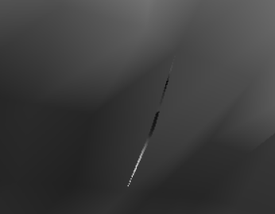

# structure of the program

## Table of Contents
- [Setup](#setup)
- [Preprocesser](#preprocesser)
- [Render](#render)
- [Animation](#real-time-animation)
- [Texture Mapping](#texture-mapping)

## Setup

## Preprocesser
### json data
In topology.json, data of each object is stored in the following structure:
```json
{
    "data":{
        "e_data" : [...],
        "e_indices" : [...],
        "f_data" : [...],
        "f_indices" : [...],
        "f_offsets" : [...],
        "f_valances" : [...],
        "v_data" : [...],
        "v_index" : [...],
        "v_indices" : [...],
        "v_offsets" : [...],
        "v_valances" : [...]
    },
    "depth" : n
}
```

### Buffers

#### buffers.js.의 createBufferData()로 생성되는 buffer
- vertex_Buffer_F : subdivition시 새로 생성되는 face point index
- offset_Buffer_F : subdivitions시 face point를 계산하는 데 사용할 vertex들의 시작 위치
- valance_Buffer_F : subdivitions시 face point를 계산하는 데 사용되는 vertex들의 개수
- pointIdx_Buffer_F : subdivition시 face point를 계산하는 데 사용되는 vetex들의 index
- vertex_Buffer_E : subdivition시 새로 생성되는 Edge point의 index
- pointIdx_Buffer_E : subdivition시 edge point를 계산하는 데 사용되는 vetex들의 index
- vertex_Buffer_V : subdivition시 새로 생성되는 vertex point의 index
- offset_Buffer_V : subdivitions시 vertex point를 계산하는 데 사용할 vertex들의 시작 위치
- valance_Buffer_V : subdivitions시 vertex point를 계산하는 데 사용되는 vertex들의 개수
- index_Buffer_V : subdivision으로 인해 위치가 이동되는 기존의 vertex의 index
- pointIdx_Buffer_V : subdivition시 vertex point를 계산하는 데 사용되는 vetex들의 index

#### buffers.js의  buffers() 함수로 생성되는 buffer
- connectivityStorageBuffers
- base_UVStorageBuffers
- extra_base_UVStorageBuffers
- extra_vertex_offsetStorageBuffers
- textureBuffer
- indices
- texcoordDatas
- indexBuffers : B-spline patch를 그릴 때 vertex들의 그리는 순서
- vertexBuffers : 
- Base_Vertex_Buffer
- Base_Normal_Buffer
- OrdinaryPointData
- texture
- limit_Buffers
- Base_Vertex_After_Buffer
- OrdinaryBuffer

### Pipelines

- pipeline_Face : compute pipeline (bindgroup : bindGroup_Face)
- pipeline_Edge : compute pipeline ( bindgroup : bindGroup_Edge)
- pipeline_Vertex : compute pipeline ( bindgroup : bindGroup_Vertex)
- pipelines : render pipeline ( bindgroup : fixedBindGroups??? changedBindGroups???)
- pipeline2 : render pipeline (bindgroup : OrdinaryPointfixedBindGroup)
- pipelineAnime : compute pipeline ( bindgroup : animeBindGroup )
- pipeline_Limit : compute pipeline


## Render

Our rendering process is divided into 3 main steps:

1. [Subdivision](#subdivision)
2. [Draw ordinary points](#draw-ordinary-points)
3. [Draw limit points](#draw-limit-points)


### Subdivision

#### ordinary points

To perform Catmull-Clark subdivision based on topology.json, we use a compute shader to calculate the position of each point. At each step of the subdivision, new vertices are generated for each face, edge and vertex. This process is executed in parallel using WebGPU's compute shader.

Following is wgsl codes of each compute shader module in function createPipelines() in pipelines.js.
``` javascript
    const module_Face = device.createShaderModule({
        code: `
        @group(0) @binding(0) var<storage, read> vertex_F: array<i32>;
        @group(0) @binding(1) var<storage, read> offset_F: array<i32>;
        @group(0) @binding(2) var<storage, read> valance_F: array<i32>;
        @group(0) @binding(3) var<storage, read> pointIdx_F: array<i32>;
        @group(0) @binding(4) var<storage, read_write> baseVertex: array<f32>;


        @compute @workgroup_size(256)
        fn compute_FacePoint(@builtin(global_invocation_id) global_invocation_id: vec3<u32>){
            let id = global_invocation_id.x;
            let start = u32(vertex_F[0]*4);

            let index = vertex_F[id];
            let offset = offset_F[id];
            let valance = valance_F[id];

            var pos = vec3(0.0,0.0,0.0);

            for (var i=offset; i<offset+valance ; i++ ){
            pos.x = pos.x + ( baseVertex[pointIdx_F[i]*4]) / f32(valance);
            pos.y = pos.y + ( baseVertex[(pointIdx_F[i]*4)+1] / f32(valance));
            pos.z = pos.z + ( baseVertex[(pointIdx_F[i]*4)+2] / f32(valance));
            }

            baseVertex[start+id*4] = pos.x;
            baseVertex[start+id*4+1] = pos.y;
            baseVertex[start+id*4+2] = pos.z;
            baseVertex[start+id*4+3] = 0;
        }
        `
    });

    const module_Edge = device.createShaderModule({
        code: `
        @group(0) @binding(0) var<storage, read> vertex_E: array<i32>;
        @group(0) @binding(1) var<storage, read> pointIdx_E: array<i32>;
        @group(0) @binding(2) var<storage, read_write> baseVertex: array<f32>;

        @compute @workgroup_size(256)
        fn compute_EdgePoint(@builtin(global_invocation_id) global_invocation_id: vec3<u32>){
            let id = global_invocation_id.x;
            let start2 = u32(vertex_E[0]*4);

            let index = vertex_E[id];
            let offset = 4*id;

            var pos = vec3(0.0,0.0,0.0);

            for (var i=offset; i<offset+4 ; i++ ){
            pos.x = pos.x + ( baseVertex[pointIdx_E[i]*4]) / 4;
            pos.y = pos.y + ( baseVertex[(pointIdx_E[i]*4)+1] ) / 4;
            pos.z = pos.z + ( baseVertex[(pointIdx_E[i]*4)+2] ) / 4;
            }

            baseVertex[start2+id*4] = pos.x;
            baseVertex[start2+id*4+1] = pos.y;
            baseVertex[start2+id*4+2] =pos.z;
            baseVertex[start2+id*4+3] = 0;
        }
        `
    });

    const module_Vertex = device.createShaderModule({
        code: `
        @group(0) @binding(0) var<storage, read> vertex_V: array<i32>;
        @group(0) @binding(1) var<storage, read> offset_V: array<i32>;
        @group(0) @binding(2) var<storage, read> valance_V: array<i32>;
        @group(0) @binding(3) var<storage, read> index_V: array<i32>;
        @group(0) @binding(4) var<storage, read> pointIdx_V: array<i32>;
        @group(0) @binding(5) var<storage, read_write> baseVertex: array<f32>;


        @compute @workgroup_size(256)
        fn compute_VertexPoint(@builtin(global_invocation_id) global_invocation_id: vec3<u32>){
            let id = global_invocation_id.x;
            let start = u32(vertex_V[0]*4);

            let index = vertex_V[id];
            let oldIndex = index_V[id];
            let offset = offset_V[id];
            let valance = valance_V[id]/2;

            var pos = vec3(0.0,0.0,0.0);

            for (var i=offset; i<offset+(valance*2) ; i++ ){
            pos.x = pos.x + ( baseVertex[pointIdx_V[i]*4]) / (f32(valance)*f32(valance));
            pos.y = pos.y + ( baseVertex[(pointIdx_V[i]*4)+1] ) / (f32(valance)*f32(valance));
            pos.z = pos.z + ( baseVertex[(pointIdx_V[i]*4)+2] ) / (f32(valance)*f32(valance));
            }

            baseVertex[start+id*4] = (pos.x + (baseVertex[oldIndex*4] * (f32(valance-2)/f32(valance))));
            baseVertex[start+id*4+1] = pos.y + (baseVertex[oldIndex*4+1] * (f32(valance-2)/f32(valance)));
            baseVertex[start+id*4+2] = pos.z + (baseVertex[oldIndex*4+2] * (f32(valance-2)/f32(valance)));
            baseVertex[start+id*4+3] = 0;
        }
        `
    });
```
These shaders are activated using the make_compute_encoder() function, which performs subdivision to the current depth, calculating new vertex positions and storing them in the Base_Vertex_Buffer.
```javascript
function make_compute_encoder(device, pipeline, bindgroup, workgroupsize, text = " ") {
    const encoder = device.createCommandEncoder({label: text});
    const pass = encoder.beginComputePass({label: text});
    pass.setPipeline(pipeline);
    pass.setBindGroup(0, bindgroup);
    pass.dispatchWorkgroups(workgroupsize);
    pass.end();
    const commandBuffer = encoder.finish();
    device.queue.submit([commandBuffer]);
}
```
Subsequently, ordinary points are rendered using a B-spline patch.

#### Extra-ordinary points
After calculating the positions of subdivided ordinary points, the positions of extra-ordinary points are calculated. Each extra-ordinary point is adjusted to its limit position. Below is the WGSL code for the compute shader that calculates limit positions, defined within the createPipelines() function in pipelines.js.

``` javascript
    const module_Limit = device.createShaderModule({
        code: `
        @group(0) @binding(0) var<storage, read_write> baseVertex: array<f32>;
        @group(0) @binding(1) var<storage, read_write> limitData: array<i32>;
        @group(0) @binding(2) var<storage, read_write> baseNormal: array<vec4f>;


        @compute @workgroup_size(256)
        fn compute_LimitPoint(@builtin(global_invocation_id) global_invocation_id: vec3<u32>){
            let id = global_invocation_id.x;
            let limitIdx= limitData[id*9];

            var limPos = vec3(baseVertex[4*limitIdx], baseVertex[4*limitIdx+1], baseVertex[4*limitIdx+2]);

            let e0 = vec3(baseVertex[4*limitData[id*9+1]],baseVertex[4*limitData[id*9+1]+1],baseVertex[4*limitData[id*9+1]+2]);
            let e1 = vec3(baseVertex[4*limitData[id*9+3]],baseVertex[4*limitData[id*9+3]+1],baseVertex[4*limitData[id*9+3]+2]);
            let e2 = vec3(baseVertex[4*limitData[id*9+5]],baseVertex[4*limitData[id*9+5]+1],baseVertex[4*limitData[id*9+5]+2]);
            let e3 = vec3(baseVertex[4*limitData[id*9+7]],baseVertex[4*limitData[id*9+7]+1],baseVertex[4*limitData[id*9+7]+2]);


            let f0 = vec3(baseVertex[4*limitData[id*9+2]],baseVertex[4*limitData[id*9+2]+1],baseVertex[4*limitData[id*9+2]+2]);
            let f1 = vec3(baseVertex[4*limitData[id*9+4]],baseVertex[4*limitData[id*9+4]+1],baseVertex[4*limitData[id*9+4]+2]);
            let f2 = vec3(baseVertex[4*limitData[id*9+6]],baseVertex[4*limitData[id*9+6]+1],baseVertex[4*limitData[id*9+6]+2]);
            let f3 = vec3(baseVertex[4*limitData[id*9+8]],baseVertex[4*limitData[id*9+8]+1],baseVertex[4*limitData[id*9+8]+2]);

            let edge_sum = e0+e1+e2+e3;
            let face_sum = f0+f1+f2+f3;

            let c2 = 4*(e0-e2)+f0-f1-f2+f3;
            let c3 = 4*(e1-e3)+f1-f2-f3+f0;
            let normal = normalize(cross(c2,c3));

            baseVertex[limitIdx*4] = ((16*limPos.x) + 4*edge_sum.x + (face_sum.x))/36;
            baseVertex[limitIdx*4+1] = ((16*limPos.y) + 4*edge_sum.y + (face_sum.y))/36;
            baseVertex[limitIdx*4+2] = ((16*limPos.z) + 4*edge_sum.z + (face_sum.z))/36;
            baseVertex[limitIdx*4+3] = 0;

            baseNormal[limitIdx] = vec4f(normal, 0);
            baseNormal[0] = vec4f(0, 0, 0, 0);
        }
        `
    });

```


### Draw ordinary points(patch)

To draw ordinary points, we use B-spline patches. Patches with the same subdivision level and texture part can be drawn without issue. However, for patches with differing subdivision levels or texture parts, additional steps are required.

For patches with different subdivision levels, tessellation is used. Below is the code that generates texcoord and index data for tessellation.

This is the code to generate the texcoord and index data for the tessellation:
```javascript
for (let i = 0; i <= depth; i++) {
    let N = max(2**(depth-i-patchLevel), 1);
    // let N = 1.0;
    let texcoordData = new Float32Array((N + 1) * (N + 1) * 2);
    let offset = 0;
    for (let row = 0; row <= N; ++row) {
        for (let col = 0; col <= N; ++col) {
            texcoordData[offset++] = (row / N);
            texcoordData[offset++] = (col / N);
        }
    }
    texcoordDatas.push(texcoordData);
    let texcoordData_byteLength = texcoordData.byteLength;
    texcoordData_byteLengths.push(texcoordData_byteLength);
    let index = new Uint32Array(N * N * 6);
    offset = 0;
    for (let row = 0; row < N; ++row) {
        for (let col = 0; col < N; ++col) {
            index[offset++] = (row + col * (N + 1));
            index[offset++] = (row + (col + 1) * (N + 1));
            index[offset++] = (row + col * (N + 1) + 1);
            index[offset++] = (row + col * (N + 1) + 1);
            index[offset++] = (row + (col + 1) * (N + 1));
            index[offset++] = ((row + 1) + (col + 1) * (N + 1));
        }
    }
    indices.push(index);
    let index_byteLength = index.byteLength;
    index_byteLengths.push(index_byteLength);
}
```


For example if max depth is 5, and the subdivision level of patch is 3, patch will be divided as following image:


Each depth's tessellation data is stored in vertexBuffers and indexBuffers. The drawIndexed() function is then called to draw the patches.


``` javascript
        pass.setPipeline(pipelines[pipelineValue]);
        pass.setBindGroup(0, fixedBindGroups[pipelineValue]);
        for (let i = 0; i <= depth; i++) { // draw -> settings.getProterty('ordinaryLevel')
            pass.setBindGroup(1, changedBindGroups[i+(depth+1)*pipelineValue]);
            pass.setVertexBuffer(0, vertexBuffers[N][i]);
            pass.setIndexBuffer(indexBuffers[N][i], 'uint32');
            if(settings.getProterty('draw')[i] == true) {
                let j = i;
                if (i > 4); j = 4;
                // pass.drawIndexed(narray[i] * narray[i] * 6,  4);
                pass.drawIndexed(narray[i] * narray[i] * 6,  j * 2 * 1000 + 100000);
            }
        }
```


```javascript
    const module1 = device.createShaderModule({
        code: /*wgsl*/ `

        struct Uniforms {
            matrix: mat4x4f,
            view: vec3f,
            time: f32,
            wireAdjust: f32,
        };
        ...
        // structs
        ...

        struct VSOutput {
            @builtin(position) position: vec4f,
            @location(0) color: vec4f,
        };

        @group(0) @binding(0) var<uniform> uni: Uniforms;
        @group(0) @binding(1) var<storage, read> pos2: array<vec4f>;
        @group(0) @binding(2) var<storage, read> base_normal: array<vec4f>;
        @group(1) @binding(0) var<storage, read> conn: array<i32>;
        @group(1) @binding(1) var<storage, read> base_UV: array<vec2f>;
        @group(1) @binding(2) var<storage, read> color: Color;

        fn B0(t: f32) -> f32 {
            return (1.0/6.0)*(1.0-t)*(1.0-t)*(1.0-t);
        }
        fn B0prime(t: f32) -> f32 {
            return (-1.0/2.0)*(1.0-t)*(1.0-t);
        }
        fn B1(t: f32) -> f32 {
            return (1.0/6.0)*(3.0*t*t*t - 6.0*t*t + 4.0);
        }
        ...
        // function for B-spline
        ...
        fn B3prime(t: f32) -> f32 {
            return (1.0/2.0)*t*t;
        }

        @vertex fn vs(
            @builtin(instance_index) instanceIndex: u32,
            @builtin(vertex_index) vertexIndex: u32,
            vert: IndexVertex
        ) -> VSOutput {
            var vsOut: VSOutput;

            let p =  B0(vert.position.x)*B0(vert.position.y)*pos2[  conn[instanceIndex*16+ 0]  ].xyz
                    +B0(vert.position.x)*B1(vert.position.y)*pos2[  conn[instanceIndex*16+ 1]  ].xyz
                    ...
                    // B-spline
                    ...
                    +B3(vert.position.x)*B2(vert.position.y)*pos2[  conn[instanceIndex*16+14]  ].xyz
                    +B3(vert.position.x)*B3(vert.position.y)*pos2[  conn[instanceIndex*16+15]  ].xyz;

            let tu = B0prime(vert.position.x)*B0(vert.position.y)*pos2[  conn[instanceIndex*16+ 0]  ]
                    +B0prime(vert.position.x)*B1(vert.position.y)*pos2[  conn[instanceIndex*16+ 1]  ]
                    ...
                    // B-spline
                    ...
                    +B3prime(vert.position.x)*B2(vert.position.y)*pos2[  conn[instanceIndex*16+14]  ]
                    +B3prime(vert.position.x)*B3(vert.position.y)*pos2[  conn[instanceIndex*16+15]  ];

            let tv = B0(vert.position.x)*B0prime(vert.position.y)*pos2[  conn[instanceIndex*16+ 0]  ]
                    +B0(vert.position.x)*B1prime(vert.position.y)*pos2[  conn[instanceIndex*16+ 1]  ]
                    ...
                    // B-spline
                    ...
                    +B3(vert.position.x)*B2prime(vert.position.y)*pos2[  conn[instanceIndex*16+14]  ]
                    +B3(vert.position.x)*B3prime(vert.position.y)*pos2[  conn[instanceIndex*16+15]  ];

            var normal = normalize(  cross(  (tu).xyz, (tv).xyz  )  );
            vsOut.position = uni.matrix * vec4f(p*5, 1);

            ...
            // vsOut.color = any color
            ...

            return vsOut;
        }

        @fragment fn fs(vsOut: VSOutput) -> @location(0) vec4f {
            return vec4f(vsOut.color);
        }
        `,
    });
```


### Draw limit points(작성중)

## Real Time Animation (작성중)
 
## Texture Mapping

### How to use texture and apply displacement mapping?

Displacement mapping adjusts the vertex positions for realistic rendering. It modifies vertex positions based on texture values. In this project, we use textureLoad() in the vertex shader to apply displacement mapping.

For proper displacement mapping, dense vertices created via subdivision and tessellation are required.

### Displacement Mapping Example in B-Spline Patches:
To perform displacement mapping in a regular B-spline patch, the UV values of the 4 inner points among the 16 points comprising the patch are used. These values are preprocessed and stored in patch.txt, allowing the UV values for each vertex in the patch to be retrieved.


```javascript
            textureValue = textureLoad(object_texture, texCoordInt, 0).x;

            if(textureValue-0.5 < 0)
            {
                vsOut.position = uni.matrix * vec4f(p*5, 1);
            }
            else
            {
                vsOut.position = uni.matrix * vec4f(p*5 + normal*(textureValue-0.5)*30, 1);
            }
```


### Cracks at Texture Seams


Problem:
When textures meet at seams, vertices may have multiple UV values. This can result in cracks due to small differences in textureLoad values.

Solution:
To mitigate this, instead of using 4 UV values for the patch, we use 16 UV values for more accurate texture data at boundaries.


```txt
578, 4, 5, 229, 639, 0, 3, 552, 641, 1, 2, 251, 643, 237, 238, 252, 0.250183, 0.595245, 0.250183, 0.595245, 0.250183, 0.595245, 0.250183, 0.595245, 0.314301, 0.576019, 0.314301, 0.576019, 0.314301, 0.576019, 0.314301, 0.576019, 0.250183, 0.560913, 0.250183, 0.560913, 0.250183, 0.560913, 0.250183, 0.560913, 0.322311, 0.543549, 0.322311, 0.543549, 0.322311, 0.543549, 0.322311, 0.543549, 
40, 22, 23, 25, 36, 12, 15, 20, 37, 13, 14, 19, 38, 16, 17, 18, 0.121277, 0.747192, 0.121277, 0.747192, 0.121277, 0.747192, 0.121277, 0.747192, 0.119461, 0.718857, 0.119461, 0.718857, 0.119461, 0.718857, 0.119461, 0.718857, 0.101593, 0.757721, 0.101593, 0.757721, 0.101593, 0.757721, 0.101593, 0.757721, 0.098282, 0.730087, 0.098282, 0.730087, 0.098282, 0.730087, 0.098282, 0.730087, 
...
```

To unify the retrieved UVs at the boundaries, the vertices after tessellation were categorized into three cases and processed accordingly.

### Case 1: Vertex Shared by Four Patches
The texture values obtained using textureLoad for each UV are averaged by dividing the sum of the values by 4.


```javascript
        if(vert.position.x == 0.0 && vert.position.y == 0.0)
            {
                textureValue = Sum_of_4value(
                    textureLoad(object_texture, vec2i(vec2f(
                        base_UV[instanceIndex*16 + 0].x*512, (1-base_UV[instanceIndex*16 + 0].y)*512
                    )), 0).x,
                    textureLoad(object_texture, vec2i(vec2f(
                        base_UV[instanceIndex*16 + 1].x*512, (1-base_UV[instanceIndex*16 + 1].y)*512
                    )), 0).x,
                    textureLoad(object_texture, vec2i(vec2f(
                        base_UV[instanceIndex*16 + 2].x*512, (1-base_UV[instanceIndex*16 + 2].y)*512
                    )), 0).x,
                    textureLoad(object_texture, vec2i(vec2f(
                        base_UV[instanceIndex*16 + 3].x*512, (1-base_UV[instanceIndex*16 + 3].y)*512
                    )), 0).x,
                );
            }
```

### Case 2: Vertex Shared by Two Patches
The UV values at the two endpoints of the edge are interpolated, and the textureLoad values for each UV are averaged.


```javascript
            else if(vert.position.y == 0.0)
            {
                textureValue = Sum_of_2value(
                    textureLoad(object_texture, vec2i(vec2f(
                        (   (1-vert.position.x) * base_UV[instanceIndex*16 +  0] + vert.position.x * base_UV[instanceIndex*16 +  8] ).x*512,
                        (1-((1-vert.position.x) * base_UV[instanceIndex*16 +  0] + vert.position.x * base_UV[instanceIndex*16 +  8])).y*512
                    )), 0).x,
                    textureLoad(object_texture, vec2i(vec2f(
                        (   (1-vert.position.x) * base_UV[instanceIndex*16 +  1] + vert.position.x * base_UV[instanceIndex*16 + 11] ).x*512,
                        (1-((1-vert.position.x) * base_UV[instanceIndex*16 +  1] + vert.position.x * base_UV[instanceIndex*16 + 11])).y*512
                    )), 0).x
                );
            }
```

### Case 3: Vertex Contained Within a Patch
For vertices that are not shared with other patches, the textureLoad is applied directly using the existing UV values.

```javascript
            else
            {
                textureValue = textureLoad(object_texture, texCoordInt, 0).x;
            }
```

### 여전히 남아있는 크랙



