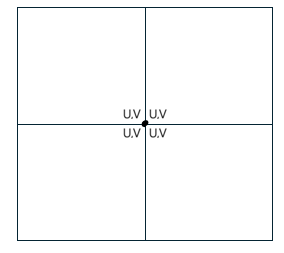

# structure of the program

## Table of Contents
- [Setup](#setup)
- [Preprocesser](#preprocesser)
- [Render](#render)
- [Animation](#real-time-animation)
- [Texture Mapping](#texture-mapping)

## Setup

## Preprocesser
### json data
In topology.json, data of each object is stored in the following structure:
```json
{
    "data":{
        "e_data" : [...],
        "e_indices" : [...],
        "f_data" : [...],
        "f_indices" : [...],
        "f_offsets" : [...],
        "f_valances" : [...],
        "v_data" : [...],
        "v_index" : [...],
        "v_indices" : [...],
        "v_offsets" : [...],
        "v_valances" : [...]
    },
    "depth" : n
}
```

### Buffers
사용되는 buffer는 다음과 같다

#### buffers.js.의 createBufferData()로 생성되는 buffer
- vertex_Buffer_F : subdivition시 새로 생성되는 face point index
- offset_Buffer_F : subdivitions시 face point를 계산하는 데 사용할 vertex들의 시작 위치
- valance_Buffer_F : subdivitions시 face point를 계산하는 데 사용되는 vertex들의 개수
- pointIdx_Buffer_F : subdivition시 face point를 계산하는 데 사용되는 vetex들의 index
- vertex_Buffer_E : subdivition시 새로 생성되는 Edge point의 index
- pointIdx_Buffer_E : subdivition시 edge point를 계산하는 데 사용되는 vetex들의 index
- vertex_Buffer_V : subdivition시 새로 생성되는 vertex point의 index
- offset_Buffer_V : subdivitions시 vertex point를 계산하는 데 사용할 vertex들의 시작 위치
- valance_Buffer_V : subdivitions시 vertex point를 계산하는 데 사용되는 vertex들의 개수
- index_Buffer_V : subdivision으로 인해 위치가 이동되는 기존의 vertex의 index
- pointIdx_Buffer_V : subdivition시 vertex point를 계산하는 데 사용되는 vetex들의 index

#### buffers.js의  buffers() 함수로 생성되는 buffer
- connectivityStorageBuffers
- base_UVStorageBuffers
- extra_base_UVStorageBuffers
- extra_vertex_offsetStorageBuffers
- textureBuffer
- indices
- texcoordDatas
- indexBuffers : B-spline patch를 그릴 때 vertex들의 그리는 순서
- vertexBuffers : 
- Base_Vertex_Buffer
- Base_Normal_Buffer
- OrdinaryPointData
- texture
- limit_Buffers
- Base_Vertex_After_Buffer
- OrdinaryBuffer

### Pipelines

- pipeline_Face : compute pipeline (bindgroup : bindGroup_Face)
- pipeline_Edge : compute pipeline ( bindgroup : bindGroup_Edge)
- pipeline_Vertex : compute pipeline ( bindgroup : bindGroup_Vertex)
- pipelines : render pipeline ( bindgroup : fixedBindGroups??? changedBindGroups???)
- pipeline2 : render pipeline (bindgroup : OrdinaryPointfixedBindGroup)
- pipelineAnime : compute pipeline ( bindgroup : animeBindGroup )
- pipeline_Limit : compute pipeline


## Render

Our rendering process is divided into 4 main steps:

1. [Subdivision](#subdivision)
3. [Draw ordinary points](#draw-ordinary-points)
4. [Draw limit points](#draw-limit-points)


### Subdivision

#### ordinary points

To perform Catmull-Clark subdivision based on topology.json, we use a compute shader to calculate the position of each point. At each step of the subdivision, new vertices are generated for each face, edge and vertex. This process is executed in parallel using WebGPU's compute shader.

Following is wgsl codes of each compute shader module in function createPipelines() in pipelines.js.
``` javascript
    const module_Face = device.createShaderModule({
        code: `
        @group(0) @binding(0) var<storage, read> vertex_F: array<i32>;
        @group(0) @binding(1) var<storage, read> offset_F: array<i32>;
        @group(0) @binding(2) var<storage, read> valance_F: array<i32>;
        @group(0) @binding(3) var<storage, read> pointIdx_F: array<i32>;
        @group(0) @binding(4) var<storage, read_write> baseVertex: array<f32>;


        @compute @workgroup_size(256)
        fn compute_FacePoint(@builtin(global_invocation_id) global_invocation_id: vec3<u32>){
            let id = global_invocation_id.x;
            let start = u32(vertex_F[0]*4);

            let index = vertex_F[id];
            let offset = offset_F[id];
            let valance = valance_F[id];

            var pos = vec3(0.0,0.0,0.0);

            for (var i=offset; i<offset+valance ; i++ ){
            pos.x = pos.x + ( baseVertex[pointIdx_F[i]*4]) / f32(valance);
            pos.y = pos.y + ( baseVertex[(pointIdx_F[i]*4)+1] / f32(valance));
            pos.z = pos.z + ( baseVertex[(pointIdx_F[i]*4)+2] / f32(valance));
            }

            baseVertex[start+id*4] = pos.x;
            baseVertex[start+id*4+1] = pos.y;
            baseVertex[start+id*4+2] = pos.z;
            baseVertex[start+id*4+3] = 0;
        }
        `
    });

    const module_Edge = device.createShaderModule({
        code: `
        @group(0) @binding(0) var<storage, read> vertex_E: array<i32>;
        @group(0) @binding(1) var<storage, read> pointIdx_E: array<i32>;
        @group(0) @binding(2) var<storage, read_write> baseVertex: array<f32>;

        @compute @workgroup_size(256)
        fn compute_EdgePoint(@builtin(global_invocation_id) global_invocation_id: vec3<u32>){
            let id = global_invocation_id.x;
            let start2 = u32(vertex_E[0]*4);

            let index = vertex_E[id];
            let offset = 4*id;

            var pos = vec3(0.0,0.0,0.0);

            for (var i=offset; i<offset+4 ; i++ ){
            pos.x = pos.x + ( baseVertex[pointIdx_E[i]*4]) / 4;
            pos.y = pos.y + ( baseVertex[(pointIdx_E[i]*4)+1] ) / 4;
            pos.z = pos.z + ( baseVertex[(pointIdx_E[i]*4)+2] ) / 4;
            }

            baseVertex[start2+id*4] = pos.x;
            baseVertex[start2+id*4+1] = pos.y;
            baseVertex[start2+id*4+2] =pos.z;
            baseVertex[start2+id*4+3] = 0;
        }
        `
    });

    const module_Vertex = device.createShaderModule({
        code: `
        @group(0) @binding(0) var<storage, read> vertex_V: array<i32>;
        @group(0) @binding(1) var<storage, read> offset_V: array<i32>;
        @group(0) @binding(2) var<storage, read> valance_V: array<i32>;
        @group(0) @binding(3) var<storage, read> index_V: array<i32>;
        @group(0) @binding(4) var<storage, read> pointIdx_V: array<i32>;
        @group(0) @binding(5) var<storage, read_write> baseVertex: array<f32>;


        @compute @workgroup_size(256)
        fn compute_VertexPoint(@builtin(global_invocation_id) global_invocation_id: vec3<u32>){
            let id = global_invocation_id.x;
            let start = u32(vertex_V[0]*4);

            let index = vertex_V[id];
            let oldIndex = index_V[id];
            let offset = offset_V[id];
            let valance = valance_V[id]/2;

            var pos = vec3(0.0,0.0,0.0);

            for (var i=offset; i<offset+(valance*2) ; i++ ){
            pos.x = pos.x + ( baseVertex[pointIdx_V[i]*4]) / (f32(valance)*f32(valance));
            pos.y = pos.y + ( baseVertex[(pointIdx_V[i]*4)+1] ) / (f32(valance)*f32(valance));
            pos.z = pos.z + ( baseVertex[(pointIdx_V[i]*4)+2] ) / (f32(valance)*f32(valance));
            }

            baseVertex[start+id*4] = (pos.x + (baseVertex[oldIndex*4] * (f32(valance-2)/f32(valance))));
            baseVertex[start+id*4+1] = pos.y + (baseVertex[oldIndex*4+1] * (f32(valance-2)/f32(valance)));
            baseVertex[start+id*4+2] = pos.z + (baseVertex[oldIndex*4+2] * (f32(valance-2)/f32(valance)));
            baseVertex[start+id*4+3] = 0;
        }
        `
    });
```
각각의 compute shader는 patch를 draw 하기 전에 make_compute_encoder()을 통해 활성화되어, 현재 depth만큼 subdivision을 수행해 새로운 vertex들의 position을 계산하고 Base_Vertex_Buffer에 저장한다.

```javascript
function make_compute_encoder(device, pipeline, bindgroup, workgroupsize, text = " ") {
    const encoder = device.createCommandEncoder({label: text});
    const pass = encoder.beginComputePass({label: text});
    pass.setPipeline(pipeline);
    pass.setBindGroup(0, bindgroup);
    pass.dispatchWorkgroups(workgroupsize);
    pass.end();
    const commandBuffer = encoder.finish();
    device.queue.submit([commandBuffer]);
}
```
이후에 ordinary points는 B-spline patch를 이용해 렌더링된다.

#### Extra-ordinary points
Ordinary points의 subdivition 된 후 위치를 계산한 후에, Extra-ordinary points의 position을 계산한다.
각각의 Extra-ordinary points는 각각의 limits position을 계산한 후 그 위치로 이동된다.
아래는 pipeline.js의 createPipelines() 함수 안에 정의된 limit position을 계산하는 compute shader의 wgsl 코드이다.

``` javascript
    const module_Limit = device.createShaderModule({
        code: `
        @group(0) @binding(0) var<storage, read_write> baseVertex: array<f32>;
        @group(0) @binding(1) var<storage, read_write> limitData: array<i32>;
        @group(0) @binding(2) var<storage, read_write> baseNormal: array<vec4f>;


        @compute @workgroup_size(256)
        fn compute_LimitPoint(@builtin(global_invocation_id) global_invocation_id: vec3<u32>){
            let id = global_invocation_id.x;
            let limitIdx= limitData[id*9];

            var limPos = vec3(baseVertex[4*limitIdx], baseVertex[4*limitIdx+1], baseVertex[4*limitIdx+2]);

            let e0 = vec3(baseVertex[4*limitData[id*9+1]],baseVertex[4*limitData[id*9+1]+1],baseVertex[4*limitData[id*9+1]+2]);
            let e1 = vec3(baseVertex[4*limitData[id*9+3]],baseVertex[4*limitData[id*9+3]+1],baseVertex[4*limitData[id*9+3]+2]);
            let e2 = vec3(baseVertex[4*limitData[id*9+5]],baseVertex[4*limitData[id*9+5]+1],baseVertex[4*limitData[id*9+5]+2]);
            let e3 = vec3(baseVertex[4*limitData[id*9+7]],baseVertex[4*limitData[id*9+7]+1],baseVertex[4*limitData[id*9+7]+2]);


            let f0 = vec3(baseVertex[4*limitData[id*9+2]],baseVertex[4*limitData[id*9+2]+1],baseVertex[4*limitData[id*9+2]+2]);
            let f1 = vec3(baseVertex[4*limitData[id*9+4]],baseVertex[4*limitData[id*9+4]+1],baseVertex[4*limitData[id*9+4]+2]);
            let f2 = vec3(baseVertex[4*limitData[id*9+6]],baseVertex[4*limitData[id*9+6]+1],baseVertex[4*limitData[id*9+6]+2]);
            let f3 = vec3(baseVertex[4*limitData[id*9+8]],baseVertex[4*limitData[id*9+8]+1],baseVertex[4*limitData[id*9+8]+2]);

            let edge_sum = e0+e1+e2+e3;
            let face_sum = f0+f1+f2+f3;

            let c2 = 4*(e0-e2)+f0-f1-f2+f3;
            let c3 = 4*(e1-e3)+f1-f2-f3+f0;
            let normal = normalize(cross(c2,c3));

            baseVertex[limitIdx*4] = ((16*limPos.x) + 4*edge_sum.x + (face_sum.x))/36;
            baseVertex[limitIdx*4+1] = ((16*limPos.y) + 4*edge_sum.y + (face_sum.y))/36;
            baseVertex[limitIdx*4+2] = ((16*limPos.z) + 4*edge_sum.z + (face_sum.z))/36;
            baseVertex[limitIdx*4+3] = 0;

            baseNormal[limitIdx] = vec4f(normal, 0);
            baseNormal[0] = vec4f(0, 0, 0, 0);
        }
        `
    });

```


### Draw ordinary points(patch)

For the ordinary points, we use b-spline patch to draw. Patch with same subdivision level and same texture part have no problem to draw. But when we draw patches with different subdivision level or different texture part, we need to do some extra work.

For the patches with different subdivision level, we use tessellation to draw.

This is the code to generate the texcoord and index data for the tessellation:
```javascript
for (let i = 0; i <= depth; i++) {
    let N = max(2**(depth-i-patchLevel), 1);
    // let N = 1.0;
    let texcoordData = new Float32Array((N + 1) * (N + 1) * 2);
    let offset = 0;
    for (let row = 0; row <= N; ++row) {
        for (let col = 0; col <= N; ++col) {
            texcoordData[offset++] = (row / N);
            texcoordData[offset++] = (col / N);
        }
    }
    texcoordDatas.push(texcoordData);
    let texcoordData_byteLength = texcoordData.byteLength;
    texcoordData_byteLengths.push(texcoordData_byteLength);
    let index = new Uint32Array(N * N * 6);
    offset = 0;
    for (let row = 0; row < N; ++row) {
        for (let col = 0; col < N; ++col) {
            index[offset++] = (row + col * (N + 1));
            index[offset++] = (row + (col + 1) * (N + 1));
            index[offset++] = (row + col * (N + 1) + 1);
            index[offset++] = (row + col * (N + 1) + 1);
            index[offset++] = (row + (col + 1) * (N + 1));
            index[offset++] = ((row + 1) + (col + 1) * (N + 1));
        }
    }
    indices.push(index);
    let index_byteLength = index.byteLength;
    index_byteLengths.push(index_byteLength);
}
```
For example if max depth is 5, and the subdivision level of patch is 3, patch will be divided as following image.


위에서 만들어진 데이터는 각각 해당하는 depth의 vertexBuffers와 indexBuffers에 저장된다. 그 후 drawIndexed(m, n)가 호출되어 n개의 patch를 m개의 vertex로 draw한다. 


``` javascript
        pass.setPipeline(pipelines[pipelineValue]);
        pass.setBindGroup(0, fixedBindGroups[pipelineValue]);
        for (let i = 0; i <= depth; i++) { // draw -> settings.getProterty('ordinaryLevel')
            pass.setBindGroup(1, changedBindGroups[i+(depth+1)*pipelineValue]);
            pass.setVertexBuffer(0, vertexBuffers[N][i]);
            pass.setIndexBuffer(indexBuffers[N][i], 'uint32');
            if(settings.getProterty('draw')[i] == true) {
                let j = i;
                if (i > 4); j = 4;
                // pass.drawIndexed(narray[i] * narray[i] * 6,  4);
                pass.drawIndexed(narray[i] * narray[i] * 6,  j * 2 * 1000 + 100000);
            }
        }
```


각각의 patch는 서로 다른 좌표에 draw되어야한다. 해당 데이터는 patch.txt에 저장되어 있고 storagebuffer로 사용한다.
patch의 vertex position들은 cubic b-spline으로 연산된다.


```javascript
    const module1 = device.createShaderModule({
        code: /*wgsl*/ `

        struct Uniforms {
            matrix: mat4x4f,
            view: vec3f,
            time: f32,
            wireAdjust: f32,
        };
        ...
        // structs
        ...

        struct VSOutput {
            @builtin(position) position: vec4f,
            @location(0) color: vec4f,
        };

        @group(0) @binding(0) var<uniform> uni: Uniforms;
        @group(0) @binding(1) var<storage, read> pos2: array<vec4f>;
        @group(0) @binding(2) var<storage, read> base_normal: array<vec4f>;
        @group(1) @binding(0) var<storage, read> conn: array<i32>;
        @group(1) @binding(1) var<storage, read> base_UV: array<vec2f>;
        @group(1) @binding(2) var<storage, read> color: Color;

        fn B0(t: f32) -> f32 {
            return (1.0/6.0)*(1.0-t)*(1.0-t)*(1.0-t);
        }
        fn B0prime(t: f32) -> f32 {
            return (-1.0/2.0)*(1.0-t)*(1.0-t);
        }
        fn B1(t: f32) -> f32 {
            return (1.0/6.0)*(3.0*t*t*t - 6.0*t*t + 4.0);
        }
        ...
        // function for B-spline
        ...
        fn B3prime(t: f32) -> f32 {
            return (1.0/2.0)*t*t;
        }

        @vertex fn vs(
            @builtin(instance_index) instanceIndex: u32,
            @builtin(vertex_index) vertexIndex: u32,
            vert: IndexVertex
        ) -> VSOutput {
            var vsOut: VSOutput;

            let p =  B0(vert.position.x)*B0(vert.position.y)*pos2[  conn[instanceIndex*16+ 0]  ].xyz
                    +B0(vert.position.x)*B1(vert.position.y)*pos2[  conn[instanceIndex*16+ 1]  ].xyz
                    ...
                    // B-spline
                    ...
                    +B3(vert.position.x)*B2(vert.position.y)*pos2[  conn[instanceIndex*16+14]  ].xyz
                    +B3(vert.position.x)*B3(vert.position.y)*pos2[  conn[instanceIndex*16+15]  ].xyz;

            let tu = B0prime(vert.position.x)*B0(vert.position.y)*pos2[  conn[instanceIndex*16+ 0]  ]
                    +B0prime(vert.position.x)*B1(vert.position.y)*pos2[  conn[instanceIndex*16+ 1]  ]
                    ...
                    // B-spline
                    ...
                    +B3prime(vert.position.x)*B2(vert.position.y)*pos2[  conn[instanceIndex*16+14]  ]
                    +B3prime(vert.position.x)*B3(vert.position.y)*pos2[  conn[instanceIndex*16+15]  ];

            let tv = B0(vert.position.x)*B0prime(vert.position.y)*pos2[  conn[instanceIndex*16+ 0]  ]
                    +B0(vert.position.x)*B1prime(vert.position.y)*pos2[  conn[instanceIndex*16+ 1]  ]
                    ...
                    // B-spline
                    ...
                    +B3(vert.position.x)*B2prime(vert.position.y)*pos2[  conn[instanceIndex*16+14]  ]
                    +B3(vert.position.x)*B3prime(vert.position.y)*pos2[  conn[instanceIndex*16+15]  ];

            var normal = normalize(  cross(  (tu).xyz, (tv).xyz  )  );
            vsOut.position = uni.matrix * vec4f(p*5, 1);

            ...
            // vsOut.color = any color
            ...

            return vsOut;
        }

        @fragment fn fs(vsOut: VSOutput) -> @location(0) vec4f {
            return vec4f(vsOut.color);
        }
        `,
    });
```


### Draw limit points

## Real Time Animation
 
## Texture Mapping

### How to use texture and apply displacement mapping?

displacement mapping은 vertex의 position을 보다 사실적인 위치로 옮기는데 의미가 있다.
즉, vetex shader에서 texture 값을 적용시켜야 한다. 이 texture 값은 WebGPU의 textureLoad함수 또는 textureSample함수를 이용해 알아낼 수 있다.
* textureLoad : 해당 vertex에서만 texture가 적용된다
* textureSample : fragment shader에서만 사용 가능하며, vertex 사이의 fragment에서 모두 적용된다

displacement mapping은 texture의 값이 vertex의 position에 직접적인 영향을 미치기 때문에, vetex의 position 변경을 위하여 본 프로젝트에서는 vertex shader에서 사용할 수 있는 textureLoad를 사용했다.

webgpu에서의 displacement mapping을 하기 위해서는 subdivision, tesselation 등으로 vertex를 촘촘하게 만들어야 texture 잘 적용된다.

### case 1: regular B-spline patch의 경우
regular B-spline patch에서 displacement mapping을 하기 위해서는 patch를 구성하는 16개의 점들 중, 안쪽의 4개 점들의 texture uv값을 이용한다. 이 값은 사전에 미리 처리되어 patch.txt에 저장되어 있어, 각 패치에 해당하는 vertex의 uv값을 가져올 수 있다.
이때 주의할 점은 같은 vertex여도 서로 다른 uv값이 존재할 수 있다.
따라서 patch의 안쪽 uv값만을 가져와야 한다.


```javascript
            textureValue = textureLoad(object_texture, texCoordInt, 0).x;

            if(textureValue-0.5 < 0)
            {
                vsOut.position = uni.matrix * vec4f(p*5, 1);
            }
            else
            {
                vsOut.position = uni.matrix * vec4f(p*5 + normal*(textureValue-0.5)*30, 1);
            }
```


### 텍스처 심에서 생기는 크랙


다만 이렇게 하더라도 크랙은 생긴다. </br>
그 이유는 하나의 vertex가 서로 다른 uv값이 존재할 수 있는데, </br>
서로 맞닿는 패치 경계에서 다른 uv값으로 texture에 접근하고 있으며 textureLoad로 나온 값이 미세하게 차이가 있을 수 있기 때문이다. </br>

이를 보완하기 위해서 patch에서 정보를 가져올 때 4개의 vertex에 대해 uv를 안쪽만이 아닌 전부 가져온다.


```txt
578, 4, 5, 229, 639, 0, 3, 552, 641, 1, 2, 251, 643, 237, 238, 252, 0.250183, 0.595245, 0.250183, 0.595245, 0.250183, 0.595245, 0.250183, 0.595245, 0.314301, 0.576019, 0.314301, 0.576019, 0.314301, 0.576019, 0.314301, 0.576019, 0.250183, 0.560913, 0.250183, 0.560913, 0.250183, 0.560913, 0.250183, 0.560913, 0.322311, 0.543549, 0.322311, 0.543549, 0.322311, 0.543549, 0.322311, 0.543549, 
40, 22, 23, 25, 36, 12, 15, 20, 37, 13, 14, 19, 38, 16, 17, 18, 0.121277, 0.747192, 0.121277, 0.747192, 0.121277, 0.747192, 0.121277, 0.747192, 0.119461, 0.718857, 0.119461, 0.718857, 0.119461, 0.718857, 0.119461, 0.718857, 0.101593, 0.757721, 0.101593, 0.757721, 0.101593, 0.757721, 0.101593, 0.757721, 0.098282, 0.730087, 0.098282, 0.730087, 0.098282, 0.730087, 0.098282, 0.730087, 
...
```

이렇게 가져온 uv를 경계에서 통일 시켜줘야하며, 
tesselation 적용 후의 vertex를 각각의 case에 나누어서 작업하였다.

1. patch의 꼭짓점에 있는 vertex(patch 4개에 포함된 vertex)

각 uv에서 textureLoad를 적용시킨 값을 뽑아내 4개의 값을 평균한다.



```javascript
        if(vert.position.x == 0.0 && vert.position.y == 0.0)
            {
                textureValue = Sum_of_4value(
                    textureLoad(object_texture, vec2i(vec2f(
                        base_UV[instanceIndex*16 + 0].x*512, (1-base_UV[instanceIndex*16 + 0].y)*512
                    )), 0).x,
                    textureLoad(object_texture, vec2i(vec2f(
                        base_UV[instanceIndex*16 + 1].x*512, (1-base_UV[instanceIndex*16 + 1].y)*512
                    )), 0).x,
                    textureLoad(object_texture, vec2i(vec2f(
                        base_UV[instanceIndex*16 + 2].x*512, (1-base_UV[instanceIndex*16 + 2].y)*512
                    )), 0).x,
                    textureLoad(object_texture, vec2i(vec2f(
                        base_UV[instanceIndex*16 + 3].x*512, (1-base_UV[instanceIndex*16 + 3].y)*512
                    )), 0).x,
                );
            }
```

2. patch의 선에 포함된 vertex(patch 2개에 포함된 vertex)

선의 끝과 끝인 두 vertex의 uv를 내분 시키고, 이를 평균한다.


```javascript
            else if(vert.position.y == 0.0)
            {
                textureValue = Sum_of_2value(
                    textureLoad(object_texture, vec2i(vec2f(
                        (   (1-vert.position.x) * base_UV[instanceIndex*16 +  0] + vert.position.x * base_UV[instanceIndex*16 +  8] ).x*512,
                        (1-((1-vert.position.x) * base_UV[instanceIndex*16 +  0] + vert.position.x * base_UV[instanceIndex*16 +  8])).y*512
                    )), 0).x,
                    textureLoad(object_texture, vec2i(vec2f(
                        (   (1-vert.position.x) * base_UV[instanceIndex*16 +  1] + vert.position.x * base_UV[instanceIndex*16 + 11] ).x*512,
                        (1-((1-vert.position.x) * base_UV[instanceIndex*16 +  1] + vert.position.x * base_UV[instanceIndex*16 + 11])).y*512
                    )), 0).x
                );
            }
```

3. patch 안에 포함된 vertex

다른 patch와 맞닿지 않는 vertex이므로, uv값 그대로 textureLoad한다.

```javascript
            else
            {
                textureValue = textureLoad(object_texture, texCoordInt, 0).x;
            }
```

### 여전히 남아있는 크랙


