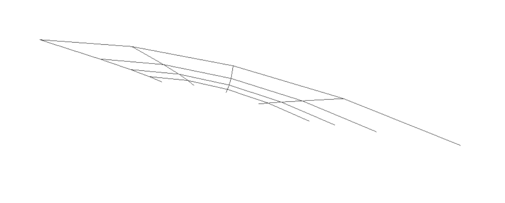

### 본 논문에서 해결하고자 하는 문제는 무엇인가?

- low polygon 모델을 더 부드럽게 하기 위해 Catmull-Clark subdivision, B-spline 기술들이 존재함.

- 웹브라우저에서 low polygon 모델의 표면을 부드럽고 가볍게 동작하도록 하는 것이 목표.

- 다만 B-spline 기술의 경우, 모델의 모든 face에 적용시킬 수 없음.

- Catmull-Clark subdivision 기술의 경우, 모든 모델에 적용시킬 수 있으나 subdivision을 통해 나온 모델 데이터는 그 크기가 너무 크고 애니메이션에 너무 비효율적임.  

- Catmull-Clark subdivision 연산을 적용시키고 나면, 모든 face가 사각형이 되며, B-spline을 적용할 수 있는 면적?(=모델을 구성하는)이 늘어남.

- 따라서 본 논문에서는 real-time에서 low polygon 모델을 B-spline으로 rendering 하며, B-spline연산이 불가능한 경우 subdivision level을 높혀 더 부드러운 모델을 render할 수 있음. 
  이때 subdivision 연산을 수행하는 face와 연산을 수행하지 않는 face는 기하학적으로 맞닿고 있어도 다른 edge와 vertex 좌표를 가지게 됨. 
  이를 보완하기 위해 tessellation 연산을 추가함.
  
- (뒤로 뺄 예정)displacement mapping 적용시 texture seam에서 하나의 vertex가 여러 uv값을 가지고 있을 수 있기 때문에 crack이 발생

---

### 해당 문제를 해결하기 위한 선행연구들은 어떠한 것들이 있는가?
- (추후 작성)
- subdivision surface
- B-spline patch 렌더링
- crack을 최소화하기 위한 방법들 : 데이터의 통일(Normal 통일, Dominant UV등), Ptex
- 

---

### 본 연구에서는 어떠한 방법으로 문제를 해결하였는가?
(예제, diagram, pseudocode를 활용)	 

### 1. Catmull-Clark subdivision surface 실시간 렌더링

- Look-up table 생성
- Catmull-Clark Subdivision 수행
- B-Spline Patch 연산
- Extra Ordinary 계산
- 다른 level 간 tessellation

#### 1.1 Look-up table 생성

(개별 작성중)

사용 Buffer 목록
- vertex_Buffer_F : subdivision시 새로 생성되는 face point index
- offset_Buffer_F : subdivisions시 face point를 계산하는 데 사용할 vertex들의 시작 위치
- valance_Buffer_F : subdivisions시 face point를 계산하는 데 사용되는 vertex들의 개수
- pointIdx_Buffer_F : subdivision시 face point를 계산하는 데 사용되는 vetex들의 index
- vertex_Buffer_E : subdivision시 새로 생성되는 Edge point의 index
- pointIdx_Buffer_E : subdivision시 edge point를 계산하는 데 사용되는 vetex들의 index
- vertex_Buffer_V : subdivision시 새로 생성되는 vertex point의 index
- offset_Buffer_V : subdivisions시 vertex point를 계산하는 데 사용할 vertex들의 시작 위치
- valance_Buffer_V : subdivisions시 vertex point를 계산하는 데 사용되는 vertex들의 개수
- index_Buffer_V : subdivision으로 인해 위치가 이동되는 기존의 vertex의 index
- pointIdx_Buffer_V : subdivision시 vertex point를 계산하는 데 사용되는 vetex들의 index

#### 1.2 생성된 데이터를 기반으로 정해진 depth만큼 Catmull-Clark subdivision 수행

topology 데이터를 제공받아 Face, Edge, Vertex Point를 계산하고 buffer에 추가한다.

Face Point : 해당 Face를 이루는 4개의 vertex의 position의 평균값

Edge Point : 해당 Edge를 이루는 2개의 vertex와 해당 edge를 공유하는 두 face의 face point의 평균값

Vertex Point : (표현을 고민중...)

#### 1.3 B-spline patch로 렌더링

B-스플라인 패치를 사용하여 draw할 때, subdivision level이 같은 patch끼리 맞닿을 경우 tessellation에 문제가 없으므로, 이 경우 patch의 vertex position들은 cubic b-spline으로 연산한다. 

- (patch를 구성할 16개의 vertex를 가져오는 법)
- (b-spline 연산 과정)

patch를 draw하기 위한 index와 texture 정보를 각 해당하는 depth의 vertexBuffers와 indexBuffers에 저장한다.후에 draw 단계에서 drawIndexed(m, n)가 호출되어 n개의 patch를 m개의 vertex로 draw한다. 

#### 1.4 extra ordinary point의 limit position과 normal vector 계산

- (limit position의 개요와 사용하는 이유)
- (normal 값을 따로 구해야하는 이유)
- (n이 4인 이유와 그 경우의 수식)

extra ordinary points는 Face point와 Vertex point에서 발생할 수 있다. 이 경우 B-spline patch를 이용할 수 없어 
limit position을 계산한 후 위치를 조정한다.  

#### 1.5 subdivision level이 다른 patch간 tessellation 적용

- (tessellation의 개요)
- (level이 다른 patch가 맞닿는 걸 판별하는 방법)
- (과정에 대한 설명)

### 2. displacement mapping시 texture seam에 의해 발생하는 crack
regular B-spline patch에서 displacement mapping을 하기 위해서는 patch를 구성하는 16개의 점들 중, 안쪽의 4개 점들의 texture uv값을 이용한다. 

그러나 서로 다른 texture가 맞닿는 texture seam의 경우, 하나의 vertex가 여러 uv값을 가질 수 있다. 이 경우 서로 맞닿는 patch 경계에서 다른 uv값으로 texture에 접근해 textureLoad로 나온 값의 미세한 차이로 인해 crack이 발생한다. 

이를 보완하기 위해서 patch에서 정보를 가져올 때 기존의 4개의 uv값만이 아닌 아래 그림과 같이 16개의 uv값을 가져온다.

이렇게 가져온 uv를 경계에서 통일 시키기 위해, 
tesselation 적용 후의 vertex를 3가지 case에 나누어서 계산한다

Case1 : 4개의 서로 다른 texture의 patch가 1개의 vertex를 공유하는 경우

4개의 uv값에서의 texture값을 평균한다

Case2 : 2개의 서로 다른 texture의 patch가 2개의 vertex를 공유하는 경우 (=하나의 edge를 공유하는 경우)

각 patch마다 공유하는 edge의 양 끝점의 uv좌표를 내분 한 후, 해당 2개의 uv좌표에서의 texture값을 평균한다

Case3 : 다른 patch와 공유하는 vertex가 없는 경우
기존 uv좌표에서의 texture 값 적용

---

기존 연구들과 비교하여 어떤 장단점이 있는가?
- "dominant UVs"와 비교하면 어떤 장단점이 있는지
- Ptex와의 비교?

---

기존 연구들과 비교해서 성능은 어떠한가?
- (추후작성)
---

